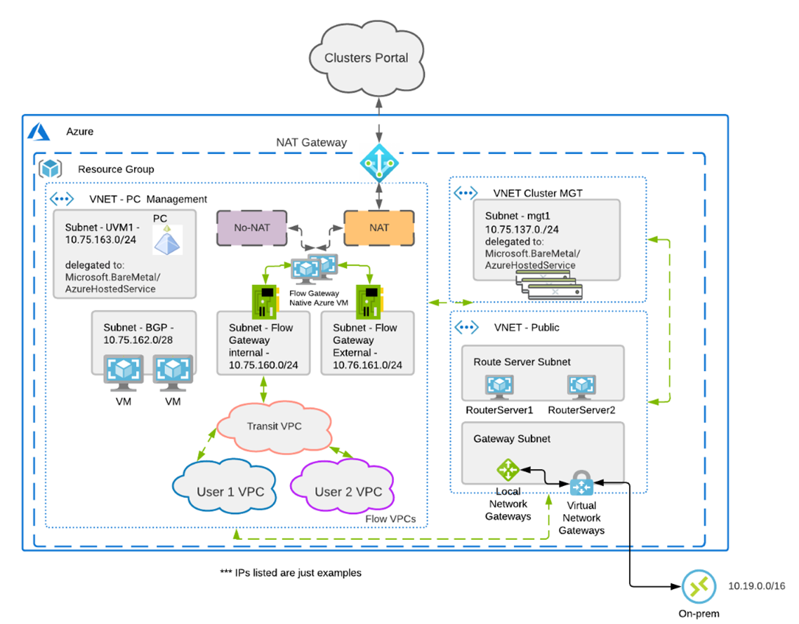

# Getting Started 

Welcome to NHT Labs.

This bootcamp aims at understanding deployment flow of NC2 on Azure. 

!!!info
       Estimated time to complete the labs is as follows:

       - **Requesting NC2 Trail** -  minutes
       - **Whitelisting Request** -  minutes
       - **Configuration on Azure** -  minutes
       - **Creating Cluseters from NC2 Console** -  minutes

## Prerequisite
Most of you might end up just reading through the lab to complete untill NC2 on Azure on RX is availale beacause Azure costs you and any software purchases on personal credit cards are not allowed.

## Environment Info

- Workshop uses for the following software versions:
  - AOS 6.7.1.5
  - Prism Central pc.2023
  - Azure Baremetal：AN36P

## Architecture

The feature of NC2 on Azure is simplifying the management of both cloud and on-premises environments by utilizing Flow Virtual Networking to create virtual networks on Azure.

## Agenda for the Lab

- Requesting NC2 on Azure Free Trial
- Whitelisting Request for NC2 on Azure
    - Upgrade a support plan
    -Create a case
- Configuration on Azure
    - Register Resource Providers
    - Configure a custom role
    - Configure a NC2 application
- Creating Cloud Clusters from NC2 Console
    - Add an organization
    - Add a cloud account
    - Create a Cluster