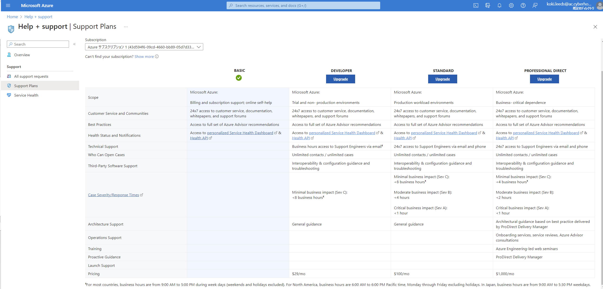
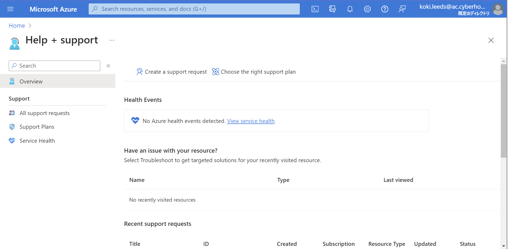
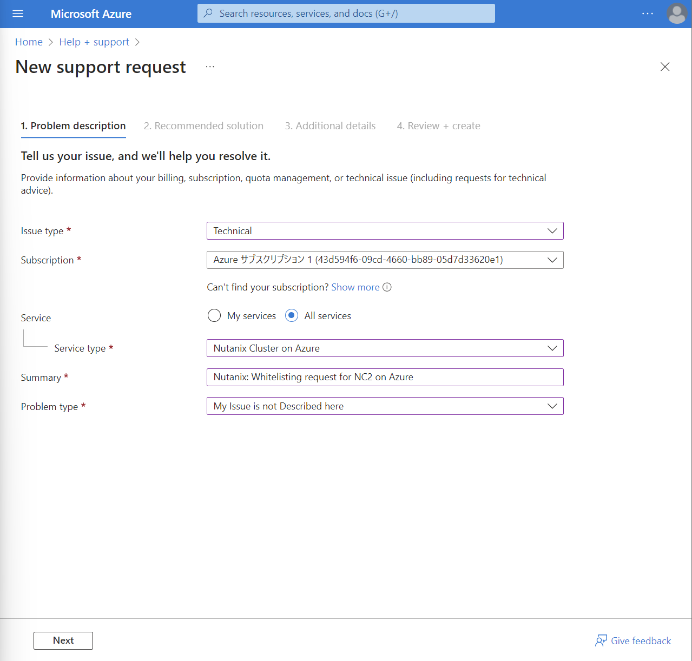
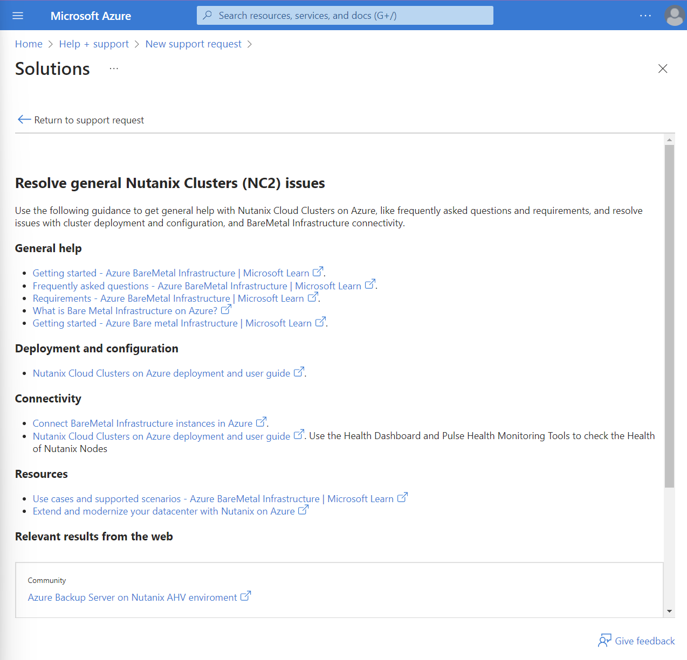
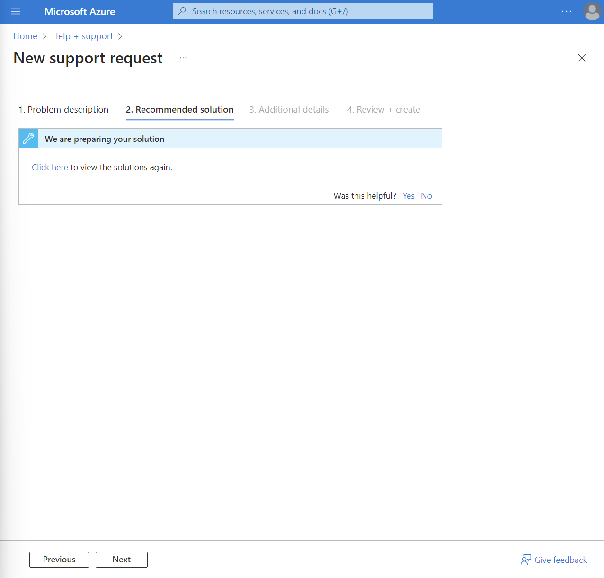

To get started NC2 on Azure, you need to subscribe a paid plan. A DEVELOPER plan is the lowest cost so upgrade to this paid plan if your current plan is BASIC.

???Info
     Your Azure subscription must be whitelisted to start NC2 on Azure trial and only support enginners from Microsoft can handle this.

After upgrading your support plan, create a support request from a Help + support page. 

Provide information as shown below and click Next.
- Issue type: Technical
- Subscription: default value (your Azure subscription)
- Service: All services
- Service type: Nutanix Cluster on Azure
- Summary: <your company name>: Whitelisting request for NC2 on Azure
- Problem type: My Issue is not Described here

Recommended solutions will be displayed but ignore these and click Return to support request.

Click Next again.

Provide additional details as you prefer, proceed to Review + create and click Create.

Genreally it will take 3 bussines days to be whitelisted. 
After your subscription has been allowlisted, you can proceed to next section.
